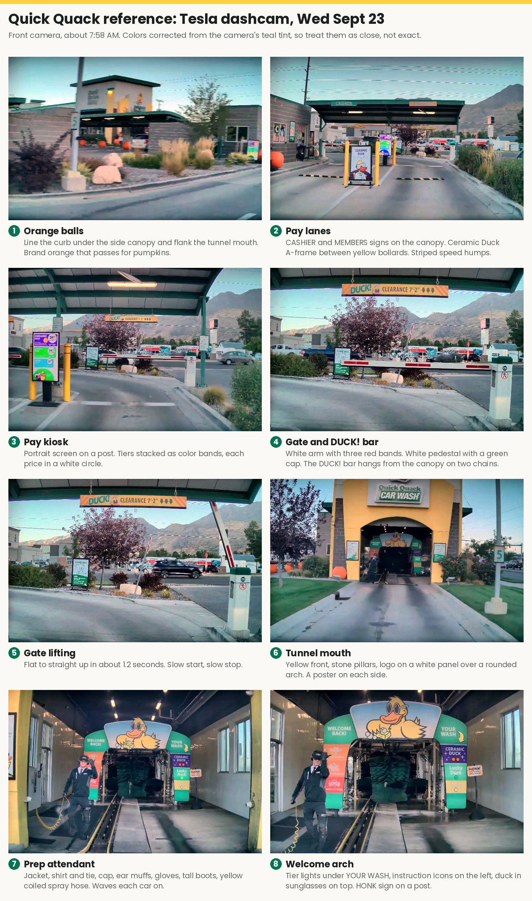

# Quick Quack Halloween Build

Our team's entry for the office Halloween contest: a walk-through Quick Quack Car Wash tunnel with a 3D-printed sign, a servo gate arm, an oscillating brush, and costumes. Contest is Fri Oct 30 (assumed).

## Start here

| Doc | What's in it |
|---|---|
| [00-README](00-README.md) | Project index, folder layout, open questions |
| [01-Project-Brief](01-Project-Brief.md) | Goal, concept, team roles, gags, the judges' bit |
| [02-Brand-Reference](02-Brand-Reference.md) | Colors, mascot, uniform, sign copy |
| [03-Materials-List](03-Materials-List.md) | What to buy, print, or bring. Costs and owners. |
| [04-Build-Schedule](04-Build-Schedule.md) | Weekly checklist through setup day |
| [05-Build-Notes](05-Build-Notes.md) | Sign, gate arm, brush, and servo details |
| [06-Reference-Footage](06-Reference-Footage.md) | What a real site looks like, and ideas from it |
| [3D walk-through](walkthrough/index.html) | Tour, walk, or map the planned tunnel. Download the file and open it in a browser, or turn on GitHub Pages. |

## How to give feedback

- **Quick comment or new idea:** open an issue. Click **Issues > New issue > Feedback**.
- **Want to change a doc:** edit the file on GitHub and open a pull request. Matt will review.
- **Want to claim a role or task:** say so in an issue, and Matt will add your name.

The biggest open questions right now:

1. Which ideas in `06-Reference-Footage.md` are worth the time? Open an issue with your top three.
2. Who wants which role: Attendant 2, Duck, or Soapy car?
3. Does anyone know the contest time, judging criteria, or what space we get?
